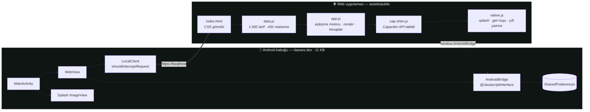

<div align="center">


# Elinde Ne Var?

**Buzdolabında ne varsa, bu akşam onu pişir.**

Kilerindeki malzemeleri işaretle — uygulama 1.592 tarifi tarayıp *şu anda* yapabileceklerini,
sonra "1 malzeme eksik", "2 malzeme eksik" diye sıralar. İnternet gerekmez, hesap zorunlu değildir,
hiçbir veri cihazdan çıkmaz.

<br>


</div>

---

## 📱 Ekran görüntüleri

<div align="center">

| Giriş | Kiler | Eşleşme |
|:---:|:---:|:---:|
|  |  |  |
| Hesap aç, giriş yap ya da<br>hesapsız devam et | 432 malzeme, 5 grup,<br>Türkçe duyarsız arama | Eksik sayısına göre<br>gruplanmış sonuçlar |

| Tarif detayı | Tüm tarifler | Filtreler |
|:---:|:---:|:---:|
|  |  |  |
| ✓ elinde / ! eksik / + opsiyonel<br>işaretli malzeme listesi | 18 mutfak, öğün türüne göre<br>ayrılmış katalog | Hızlı filtre, eksik toleransı,<br>temel malzeme anahtarı |

</div>

---

## 🎯 Uygulama ne yapıyor?

Klasik tarif uygulamaları "ne pişirmek istiyorsun?" diye sorar. Bu uygulama tersini yapar:
**"elinde ne var?"** diye sorar ve cevabı bir küme kapsama problemi olarak çözer.

```
Kiler seçimi  ──►  Eşleşme motoru  ──►  Eksik sayısına göre gruplanmış tarifler
 (432 malzeme)      (1.592 tarif)        TAM · 1 EKSİK · 2 EKSİK · 3 EKSİK
```

Uygulamanın tamamı üç sekmeden oluşur:

| Sekme | İşlev |
|---|---|
| **Elindeki malzemeler** | Evdekileri işaretlediğin kiler. Seçtiklerin çip olarak üstte birikir, alt bardaki CTA canlı olarak "23 tarifi şimdi yapabilirsin" der. |
| **Tarifler** | İki mod: **Elimdekiler** (eşleşme motoru sonuçları) ve **Tüm tarifler** (18 mutfak × 9 öğün türü katalog). |
| **Favoriler** | Yıldızladığın tarifler. Kiler değişse de burada kalır. |

---

## 🧱 Kullanılan teknolojiler

### Genel mimari

Uygulama **tek bir yerel HTML/CSS/JS bundle'ı** olarak yazılmış ve elle yazılmış ince bir
**Android WebView kabuğuna** paketlenmiş. Ne bir JS framework'ü var, ne bir build adımı,
ne de bir sunucu.



### Katman katman

<table>
<tr><th align="left">Katman</th><th align="left">Teknoloji</th><th align="left">Neden</th></tr>

<tr>
<td><b>Native kabuk</b></td>
<td>

Java · `android.webkit.WebView`<br>
D8 derleyici (`min-api 23`)<br>
`minSdk 23` → `targetSdk 34`

</td>
<td>Tek <code>MainActivity</code>, 11 KB dex. Cordova/Capacitor <b>runtime'ı paketlenmemiş</b> — yalnızca ihtiyaç duyulan 4 yetenek elle yazılmış.</td>
</tr>

<tr>
<td><b>Asset sunumu</b></td>
<td>

`shouldInterceptRequest`<br>
sanal origin: `https://localhost`

</td>
<td>
<code>file://</code> yerine sanal HTTPS origin kullanılıyor. Sebebi kritik: <b>güvenli bağlam</b> olmadan <code>crypto.subtle</code> (PBKDF2) tarayıcıda tanımsızdır. MIME tablosu <code>.js .css .html .json .png .webp .svg .woff .woff2</code> için elle yazılmış.
</td>
</tr>

<tr>
<td><b>JS ↔ Java köprüsü</b></td>
<td>

`@JavascriptInterface`<br>
`window.AndroidBridge`

</td>
<td>7 metot: <code>prefGet · prefSet · prefRemove · prefKeys · hideSplash · exitApp · platform</code></td>
</tr>

<tr>
<td><b>Uyumluluk katmanı</b></td>
<td>

`cap-shim.js`

</td>
<td>
<code>AndroidBridge</code>'i <b>Capacitor Plugins API'sinin</b> aynısına sarar (<code>Preferences</code>, <code>StatusBar</code>, <code>SplashScreen</code>, <code>App</code>). Böylece <code>native.js</code>, uygulama ister Capacitor ile ister bu sade kabukla paketlensin <b>tek satır değişmeden</b> çalışır. Tarayıcıda ikisi de yoksa sessizce devre dışı kalır.
</td>
</tr>

<tr>
<td><b>UI</b></td>
<td>

Vanilla JS (IIFE, `"use strict"`)<br>
Template literal render<br>
Event delegation

</td>
<td>Sıfır bağımlılık, sıfır sanal DOM. Tek bir <code>document.addEventListener('click')</code> tüm etkileşimleri <code>data-*</code> attribute'larıyla yakalıyor.</td>
</tr>

<tr>
<td><b>Stil</b></td>
<td>

Saf CSS · Custom Properties<br>
`color-mix()` · `dvh` · `env(safe-area-inset-*)`

</td>
<td>Tek koyu tema, 480px genişliğe sabitlenmiş telefon kabuğu; ≥900px'te ortalanmış "cihaz" görünümüne dönüşür.</td>
</tr>

<tr>
<td><b>Tipografi</b></td>
<td>

**Fraunces** (başlıklar, serif)<br>
**Manrope** (gövde)<br>
**JetBrains Mono** (sayılar)

</td>
<td>16 WOFF2 dosyası <b>APK içine gömülü</b>, <code>latin</code> + <code>latin-ext</code> subset'leri <code>unicode-range</code> ile ayrılmış. Google Fonts'a hiç istek gitmez.</td>
</tr>

<tr>
<td><b>Kalıcılık</b></td>
<td>

`localStorage` (birincil)<br>
`SharedPreferences` (yedek)

</td>
<td>Aşağıdaki <a href="#-veri-dayanıklılığı-çift-yazma">çift yazma</a> bölümüne bakın.</td>
</tr>

<tr>
<td><b>Kriptografi</b></td>
<td>

WebCrypto · PBKDF2-SHA256<br>
120.000 iterasyon · 16 byte salt

</td>
<td><code>crypto.subtle</code> yoksa DJB2 hash'e düşer ve <code>weak:</code> ön ekiyle işaretlenir.</td>
</tr>

<tr>
<td><b>PWA</b></td>
<td>

`manifest.json` · maskable ikonlar

</td>
<td>Aynı bundle tarayıcıda PWA olarak da kurulabilir; <code>navigator.storage.persist()</code> çağrılır.</td>
</tr>
</table>

> [!NOTE]
> **Ağ bağımlılığı sıfırdır.** `AndroidManifest.xml` içinde hiçbir `<uses-permission>` yok —
> `INTERNET` izni bile alınmamış. `usesCleartextTraffic="false"`. Kaynak kodda tek bir
> `fetch`, `XMLHttpRequest` veya harici URL geçmiyor.

---

## ⚙️ Kullanım mantığı

### 1. Eşleşme motoru

Kalbi 20 satırlık bir fonksiyon. Her tarif için elindekilerle kesişim hesaplanır:

```js
const BASICS = ['tuz','karabiber','su','zeytinyagi','aycicek-yagi','tereyagi'];

function has(id){ return S.sel.has(id) || (S.basics && BASIC.has(id)); }

function match(r){
  const req  = r.i;                              // zorunlu malzemeler
  const have = req.filter(has);
  const miss = req.filter(id => !has(id));

  // uyum yüzdesi: temel malzemeler sayılmaz, böylece tarifler adil kıyaslanır
  const core     = S.basics ? req.filter(id => !BASIC.has(id)) : req;
  const coreHave = core.filter(has);
  const overlap  = req.filter(id => S.sel.has(id) && !BASIC.has(id)).length;

  return { req, have, miss, core, overlap,
           optHave: (r.o||[]).filter(has).length,
           pct: core.length ? Math.round(coreHave.length / core.length * 100) : 100 };
}
```

**Tasarım kararı:** tuz, su, yağ gibi 6 "temel malzeme" varsayılan olarak elinde sayılır ama
**yüzde hesabına katılmaz**. Aksi halde 3 malzemeli bir tarif ile 12 malzemeli bir tarif
haksız yere aynı skoru alırdı.

### 2. Filtreleme ve sıralama

```js
for (const r of REC) {
  const m = match(r);
  if (!searching) {
    if (m.overlap < 1)            continue;   // en az 1 gerçek malzeme ortak olmalı
    if (m.miss.length > S.maxMiss) continue;  // eksik toleransı (0–3)
  }
  if (!quickOk(r, m)) continue;               // hızlı filtre
  if (q && r._s.indexOf(q) < 0) continue;     // metin araması
  out.push({ r, m });
}

out.sort((a, b) =>
     a.m.miss.length - b.m.miss.length   // 1. en az eksik
  || b.m.pct         - a.m.pct           // 2. en yüksek uyum
  || b.m.overlap     - a.m.overlap       // 3. en çok ortak malzeme
  || b.m.optHave     - a.m.optHave       // 4. opsiyoneller de elinde mi
  || a.r.t           - b.r.t);           // 5. en kısa süre
```

Sonuçlar `0 / 1 / 2 / 3 / 4+` eksik kovalarına bölünür ve
**ŞİMDİ YAPABİLİRSİN → 1 MALZEME EKSİK → …** başlıklarıyla ekrana basılır.

> Arama yapılırken eksik filtresi **bilinçli olarak** devre dışı bırakılır —
> kullanıcı bir tarifi adıyla arıyorsa onu bulmalıdır.

### 3. Türkçe duyarsız arama

Her malzeme ve tarif, yükleme anında normalize edilmiş bir arama dizesi (`_s`) ile indekslenir:

```js
function norm(s){
  return String(s)
    .replace(/İ/g,'I').replace(/[Iı]/g,'i')
    .replace(/[şŞ]/g,'s').replace(/[ğĞ]/g,'g').replace(/[üÜ]/g,'u')
    .replace(/[öÖ]/g,'o').replace(/[çÇ]/g,'c').replace(/[âÂ]/g,'a')
    .toLowerCase();
}
```

Böylece `çorba` ≡ `corba`, `ıspanak` ≡ `ispanak`, `Şeftali` ≡ `seftali`.
Tarifin arama dizesi **adı + mutfağı + etiketleri + tüm malzeme adlarını** içerir,
yani "domates" araması domatesli tarifleri de getirir.

### 4. Hızlı filtreler

16 hızlı filtre var; ikisi tamamen **türetilmiş** — veride yazmaz, açılışta hesaplanır:

| Filtre | Kural |
|---|---|
| `Şimdi yapılabilir` | `miss.length === 0` |
| `≤ 30 dk` | `r.t <= 30` |
| `Pişirmesiz` | `r.k === 0` |
| `Pratik` | **türetilmiş:** ≤ 30 dakika **ve** ≤ 7 zorunlu malzeme |
| Diğer 12 | etiket eşleşmesi (`vejetaryen`, `vegan`, `çorba`, `tatlı`, …) |

---

## 🗄️ Veri modeli

`data.js` tek bir dosyada, tek satırlık kayıtlar halinde yazılmış — JSON değil,
**doğrudan JS literal** (parse maliyeti sıfır). Alan adları tek harfe indirilmiş:

```js
// Malzeme:  i=id  n=ad  c=kategori  l=yer (f/z/p)  e=emoji
{i:'domates', n:'Domates', c:'sebze', l:'f', e:'🍅'}

// Tarif:  n=ad cu=mutfak t=dakika d=zorluk s=kişi k=pişirme(1/0)
//         g=etiketler i=zorunlu o=opsiyonel a=adımlar
{n:'Menemen', cu:'Türk', t:15, d:'Kolay', s:2, k:1,
 g:['vejetaryen','kahvaltı','pratik'],
 i:['yumurta','domates','yesil-biber','tereyagi','tuz'],
 o:['sogan','beyaz-peynir','pul-biber'],
 a:['Biberleri ince doğrayıp tereyağında 3-4 dakika kavurun.',
    'Kabuğu soyulmuş domatesleri ekleyin, suyunu çekene kadar orta ateşte pişirin.',
    'Tuz ve pul biberi ekleyin, yumurtaları kırıp hafifçe karıştırarak pişirin.',
    'Yumurta kıvam alınca ocaktan alın, sıcak servis edin.']}
```

### Veri kümesi rakamları

<table>
<tr>
<td valign="top">

**Genel**

| | |
|---|--:|
| Tarif | **1.592** |
| Malzeme | **432** |
| Mutfak | **18** |
| Toplam pişirme adımı | **7.612** |
| Malzeme bağlantısı | **11.596** |
| Opsiyonel bağlantı | **5.343** |
| Tarif başına ort. malzeme | **7,3** |
| Süre aralığı | 5 – 300 dk |
| Medyan süre | 35 dk |

</td>
<td valign="top">

**Mutfaklar**

| | | | |
|---|--:|---|--:|
| Türk | 478 | Kore | 64 |
| Dünya | 113 | Vietnam | 64 |
| İtalyan | 73 | Tayland | 63 |
| İspanyol | 66 | Orta Doğu | 62 |
| İngiliz | 66 | Meksika | 61 |
| Latin Amerika | 66 | Çin | 60 |
| Yunan | 65 | Amerikan | 60 |
| Hint | 59 | Japon | 58 |
| Fransız | 58 | Belçika | 56 |

</td>
</tr>
</table>

<details>
<summary><b>Etiket ve kategori dağılımı</b></summary>

<br>

| Etiket | Tarif | | Malzeme kategorisi | Adet |
|---|--:|---|---|--:|
| vejetaryen | 993 | | Sebze & Yeşillik | 70 |
| ana-yemek | 635 | | Konserve & Soslar | 52 |
| pratik | 516 | | Makarna, Pirinç & Un | 48 |
| vegan | 462 | | Et, Tavuk & Balık | 46 |
| pişirmesiz | 219 | | Baharat & Kuru Ot | 45 |
| meze | 166 | | Meyve | 32 |
| tatlı | 158 | | Süt Ürünleri | 31 |
| çorba | 134 | | Bakliyat & Tahıl | 26 |
| kahvaltı | 133 | | Kuruyemiş & Tohum | 22 |
| atıştırmalık | 130 | | Pastacılık & Tatlı | 20 |
| salata | 125 | | Dondurulmuş | 17 |
| içecek | 110 | | İçecek & Diğer | 15 |
| ekmek | 102 | | Yağ & Sirke | 8 |

**Zorluk:** Kolay 1.045 · Orta 484 · Zor 63
**Pişirme gerektirmeyen:** 219 tarif

</details>

### Açılışta çalışan türetme adımları

`data.js` sonunda üç IIFE, veriyi yazarken unutulan alanları otomatik tamamlar:

1. **`pişirmesiz` etiketi** — `k === 0` olan tariflere eklenir
2. **`pratik` etiketi** — ≤ 30 dk **ve** ≤ 7 malzeme olanlara eklenir
3. **Öğün türü** — etiketi eksik ~25 tarife elle tanımlı eşleme tablosundan atanır

`app.js` de yüklemede kendi normalizasyonlarını yapar: aynı adlı tarifleri teker,
malzeme kategorilerini 13'ten UI'daki 5 gruba indirger (`GMAP` + `GFIX` istisna tablosu).

---

## 🔐 Hesap sistemi

Tamamen **istemci tarafında**, sunucusuz. `bnv:accounts` anahtarında saklanır:

```js
async function hashPw(pw, salt){
  try{
    const enc  = new TextEncoder();
    const k    = await crypto.subtle.importKey('raw', enc.encode(pw), 'PBKDF2', false, ['deriveBits']);
    const bits = await crypto.subtle.deriveBits(
      { name:'PBKDF2', salt: enc.encode(salt), iterations: 120000, hash:'SHA-256' }, k, 256);
    return 'pbkdf2:' + hex(bits);
  } catch(e){
    // güvenli bağlam yoksa: zayıf ama en azından açıkça işaretli
    return 'weak:' + djb2(pw + '|' + salt);
  }
}
```

| Özellik | Davranış |
|---|---|
| Salt | Kullanıcı başına 16 byte, `crypto.getRandomValues` |
| Veri ayrımı | Her hesabın kileri ayrı anahtarda: `bnv:data:<userId>` |
| Misafir modu | `bnv:data:guest` — hesap açmadan tam işlevsellik |
| Göç | Eski tek kullanıcılı sürümün `bnv:v1` anahtarı misafir moduna taşınır |
| Hesap silme | Çift dokunuşla onay, hem hesabı hem `bnv:data:<id>` verisini siler |

> [!WARNING]
> Uygulamanın kendi arayüzünde de yazdığı gibi: bu bir **sunucu güvenliği katmanı değildir**.
> Aynı cihazı paylaşan kullanıcıların listelerini ayrı tutmak için tasarlanmıştır.
> Şifreler hiçbir yere gönderilmez, cihazdan çıkmaz.

---

## 💾 Veri dayanıklılığı (çift yazma)

WebView'in `localStorage`'ı, Android tarafında sistem temizliğiyle nadiren de olsa silinebilir.
`native.js` bunu `Storage.prototype`'ı **maymun yamalayarak** çözer:

```js
var origSet = Storage.prototype.setItem;

Storage.prototype.setItem = function (k, v) {
  origSet.apply(this, arguments);                    // 1. normal davranış
  if (this === window.localStorage && k.indexOf('bnv:') === 0) {
    Pref.set({ key: k, value: String(v) })           // 2. sessizce SharedPreferences'a kopya
        .catch(function () {});
  }
};
```

Açılışta `bnv:accounts` yoksa ama SharedPreferences'ta yedek varsa geri yüklenip
sayfa **bir kez** yenilenir. Sonsuz döngüyü önleyen bayrak `sessionStorage`'da tutulur —
çünkü `localStorage` silinse bile `sessionStorage` ayakta kalır.

Yalnızca `bnv:` ön ekli anahtarlar aynalanır; yedekleme tamamen `catch`'lenmiştir,
başarısız olursa uygulama hiç fark etmez.

---

## 📲 Native davranışlar

### Android geri tuşu

Java tarafı `onBackPressed`'de WebView'e JS enjekte eder ve **cevaba göre** karar verir:

```java
webView.evaluateJavascript(
  "(function(){try{return window.__androidBack?(window.__androidBack(),'ok'):'none'}" +
  "catch(e){return 'none'}})()", value -> { if ("none") moveTaskToBack(true); });
```

JS tarafı ise şu önceliği uygular:

```
1. Tarif kartı açıksa    →  kapat (Escape event'i dispatch edilir)
2. Giriş ekranındaysa    →  uygulamadan çık
3. Kiler dışı sekmedeyse →  kiler sekmesine dön
4. 2 saniye içinde 2. basış → çık    (aksi halde "Çıkmak için tekrar bas" toast'ı)
```

### Splash screen

`FrameLayout` içinde WebView'in üstüne `ImageView` konur. Web tarafı ilk render'ı bitirince
`requestAnimationFrame` → `SplashScreen.hide()` → `AndroidBridge.hideSplash()` zinciriyle
kaldırılır. Java tarafında ayrıca `SPLASH_TIMEOUT_MS` güvenlik ağı vardır — JS hiç
cevap vermezse splash yine de kalkar.

### Diğer WebView ayarları

```java
setJavaScriptEnabled(true)      setDomStorageEnabled(true)
setDatabaseEnabled(true)        setSupportZoom(false)
setBuiltInZoomControls(false)   setDisplayZoomControls(false)
setTextZoom(100)                setUseWideViewPort(true)
setLoadWithOverviewMode(true)   setOverScrollMode(OVER_SCROLL_NEVER)
setLongClickable(false)         setMediaPlaybackRequiresUserGesture(true)
```

Durum ve navigasyon çubukları `#080C0A` ile boyanır, ekran `portrait`'e kilitlenir,
`launchMode="singleTop"`, `windowSoftInputMode="adjustResize"`.

---

## 🎨 Tasarım sistemi

Tek koyu tema, CSS custom property olarak tanımlı:

```css
:root{
  --ground:#080C0A;   --surface:#111815;  --surface2:#18211D;  --surface3:#232E28;
  --ink:#EAF2EC;      --ink2:#9DB0A5;     --ink3:#7A8D83;      --line:#232E29;
  --accent:#4FD6AC;   --accent-soft:#123028;  --on-accent:#04211A;
  --warm:#F5834F;     --amber:#E9B369;
  --r:14px;           --rs:10px;
}
```

<div align="center">

`#080C0A` zemin · `#111815` yüzey · `#4FD6AC` vurgu · `#E9B369` kehribar · `#F5834F` sıcak

</div>

| Karar | Uygulama |
|---|---|
| Tipografik hiyerarşi | Başlıklar **Fraunces** serif, gövde **Manrope**, tüm sayılar **JetBrains Mono** + `font-variant-numeric: tabular-nums` |
| Sabit ölçek | `app.js` açılışta viewport meta'sını zorla yeniden yazar (`user-scalable=no`) — WebView'de yakınlaştırma kazası olmasın diye |
| Telefon kabuğu | `max-width: 480px`; ≥520px'te kenarlıklar, ≥900px'te 26px köşeli, gölgeli, ortalanmış "cihaz" |
| Erişilebilirlik | `role="tablist"` / `aria-selected` / `aria-pressed` / `aria-hidden` / `role="alert"`; `:focus-visible` için 2px vurgu halkası |
| Çentik desteği | `env(safe-area-inset-*)` topbar, tabbar ve tray'de |
| Dokunma geri bildirimi | `.chip:active { transform: scale(.96) }` |

---

## 📂 Proje yapısı

```
main.apk  (616 KB)
├── AndroidManifest.xml          minSdk 23 · targetSdk 34 · izin yok
├── classes.dex                  11 KB — MainActivity + LocalClient + AndroidBridge
├── resources.arsc               2 KB
├── res/
│   ├── mipmap-*/ic_launcher.png 5 yoğunluk
│   └── drawable/splash.png
└── assets/public/               ← web uygulamasının tamamı
    ├── index.html               31 KB · tüm CSS gömülü
    ├── data.js                 1.09 MB · 1.592 tarif + 432 malzeme
    ├── app.js                   34 KB · eşleşme motoru, render, hesaplar
    ├── cap-shim.js             2.5 KB · Capacitor API taklidi
    ├── native.js               6.1 KB · splash, geri tuşu, çift yazma
    ├── manifest.json                  · PWA manifest
    ├── fonts/                   16 × WOFF2 (Fraunces · Manrope · JetBrains Mono)
    └── icons/                    7 × WEBP (48 → 512, maskable)
```

**Yükleme sırası önemlidir:**

```html
<script src="data.js"></script>    <!-- 1. veri (global REC, ING, CATS, LOCS) -->
<script src="app.js"></script>     <!-- 2. uygulama (IIFE, hemen boot eder)   -->
<script src="cap-shim.js"></script><!-- 3. köprü taklidi (Capacitor varsa no-op)-->
<script src="native.js"></script>  <!-- 4. native davranışlar                  -->
```

---

## 🚀 Çalıştırma

### Tarayıcıda (build gerekmez)

```bash
cd assets/public
python3 -m http.server 8000
# → http://localhost:8000
```

> `file://` üzerinden açmak da çalışır, ancak **düz `http://`** üzerinden açarsanız
> `crypto.subtle` tanımsız olur ve hesap sistemi devre dışı kalır — uygulama bunu
> tespit edip kullanıcıyı uyarır ve "Hesapsız devam et"i önerir.
> `localhost` ve `https://` güvenli bağlamdır, sorun çıkmaz.

### APK derleme

Web varlıkları `app/src/main/assets/public/` altına konur, ardından:

```bash
./gradlew assembleDebug        # geliştirme
./gradlew assembleRelease      # yayın (imzalama yapılandırması gerekir)
```

Web tarafında **hiçbir build adımı yoktur** — bundler, transpiler, minifier kullanılmaz.
`assets/public/` içindeki dosyalar aynen APK'ya girer.

---

## 🧭 Mimari kararlar ve gerekçeleri

| Karar | Gerekçe |
|---|---|
| **Framework yok** | 1.592 kayıtlık statik bir veri kümesi ve 3 ekran için React/Vue'nun getireceği runtime maliyeti, bakım yükü ve build zinciri gerekçelendirilemez. Toplam JS 1.13 MB'ın 1.09 MB'ı veridir. |
| **Capacitor runtime'ı yok, API'si var** | Capacitor'ın tamamı yerine yalnızca kullanılan 4 plugin'in arayüzü taklit edildi. Kabuk 11 KB'ta kaldı; yarın Capacitor'a geçilmek istenirse `cap-shim.js` silinir, başka hiçbir dosya değişmez. |
| **`https://localhost` sanal origin** | Yalnızca `crypto.subtle`'ı erişilebilir kılmak için. `file://` ile PBKDF2 çalışmazdı. |
| **Sunucusuz hesaplar** | Uygulamanın hiçbir işlevi ağ gerektirmiyor; sırf giriş ekranı için backend eklemek tüm çevrimdışı garantisini yıkardı. |
| **JS literal veri, JSON değil** | 1.09 MB'lık bir JSON'u `JSON.parse` etmek yerine motor doğrudan parse ediyor; ayrıca tek harfli alan adları dosyayı belirgin şekilde küçültüyor. |
| **Kilerde temel malzeme istisnası** | Kimse "tuz var mı?" diye işaretlemek istemez, ama tuz yüzdeye katılırsa kısa tarifler haksız avantaj kazanır. İkisi ayrıştırıldı. |
| **Türetilmiş etiketler** | `pratik` ve `pişirmesiz` elle yazılsaydı 1.592 kayıtta tutarsızlık kaçınılmazdı; kuraldan hesaplanıyor. |
| **Çift yazma** | Kullanıcının 50 malzemelik kilerini ve favorilerini kaybetmesi, uygulamayı tekrar açmama sebebidir. Maliyeti birkaç satır. |

---

## 📋 Teknik künye

| | |
|---|---|
| **Paket adı** | `com.efekesler.elindenevar` |
| **Sürüm** | 1.0 (versionCode 1) |
| **Min / Target SDK** | 23 (Android 6.0) / 34 (Android 14) |
| **APK boyutu** | 616 KB |
| **İzinler** | Hiçbiri |
| **Activity** | 1 (`MainActivity`) — service, receiver, provider yok |
| **Dex derleyici** | D8 v0.1.21 |
| **Ekran yönü** | Portrait (kilitli) |
| **Dil** | Türkçe (`lang="tr"`, `dir="ltr"`) |
| **Tema** | Yalnızca koyu |

---

<div align="center">
<br>

**Elinde Ne Var?** · Efe Kesler

<sub>Malzemeni seç, gerisini uygulama bulsun.</sub>

</div>
